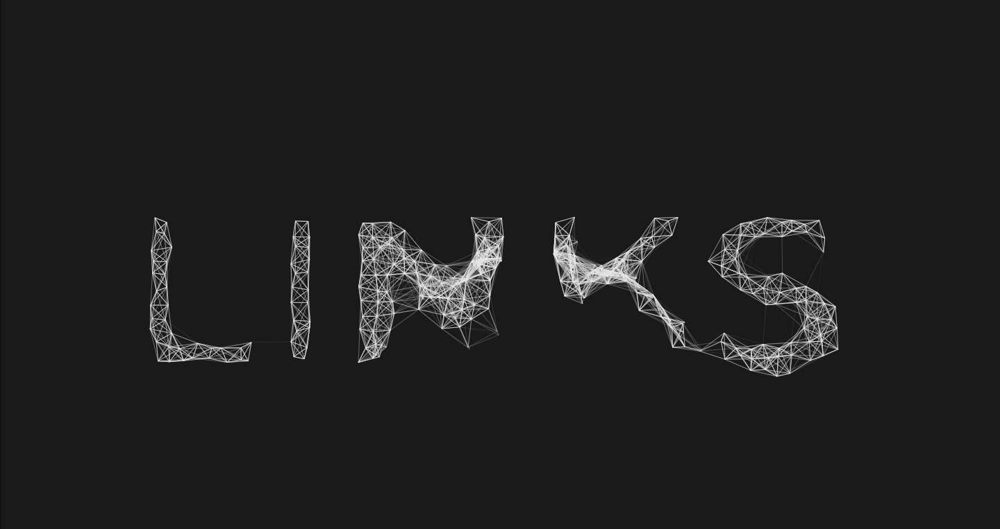
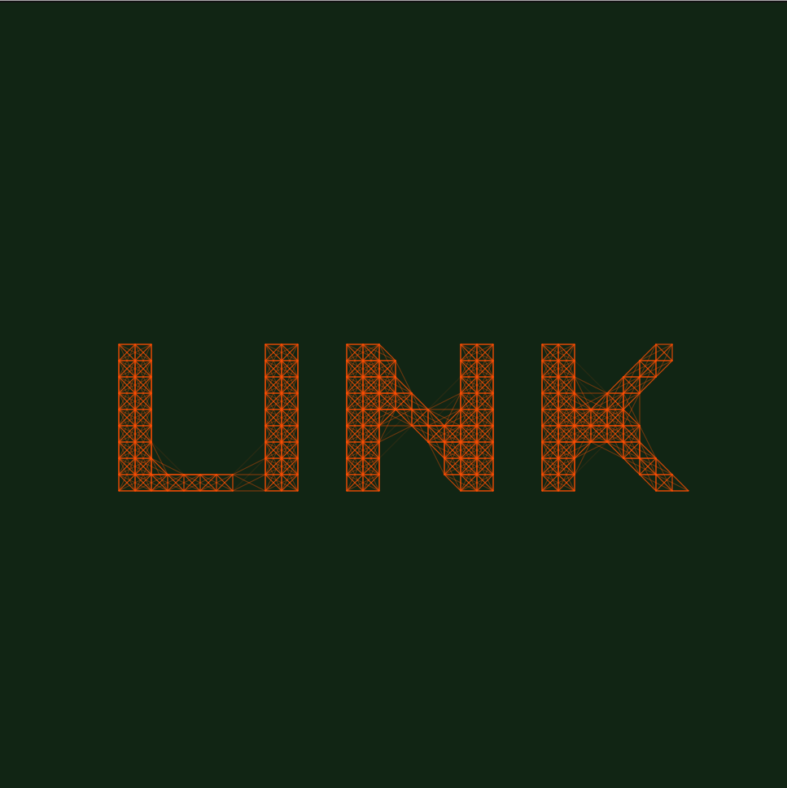
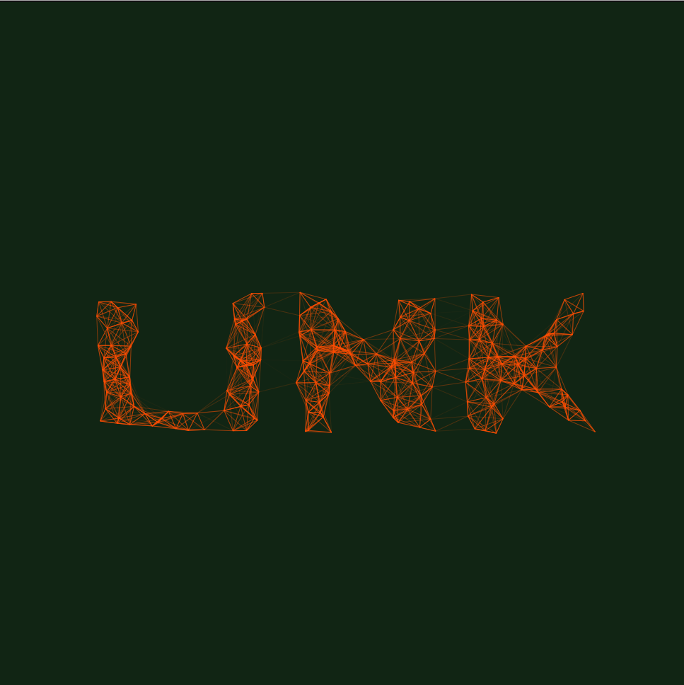
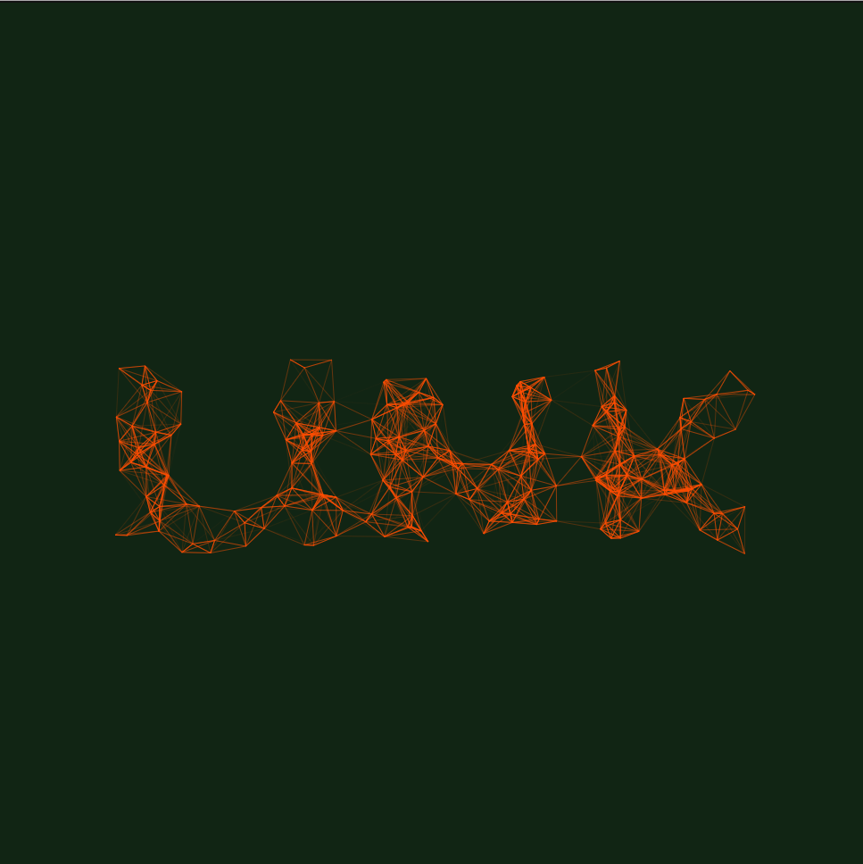
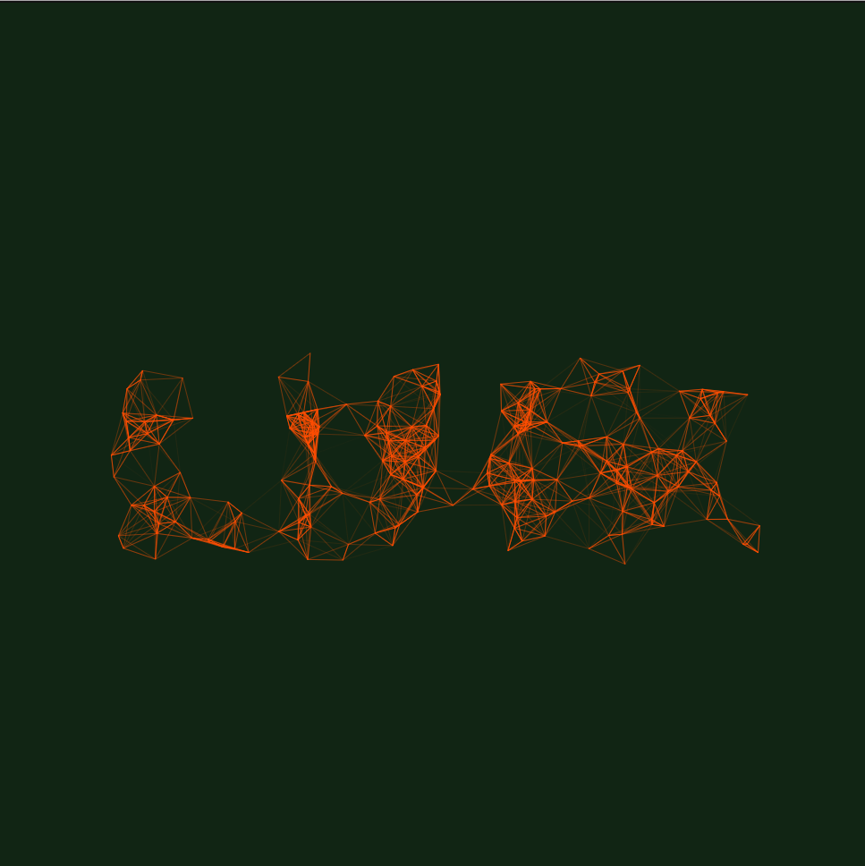
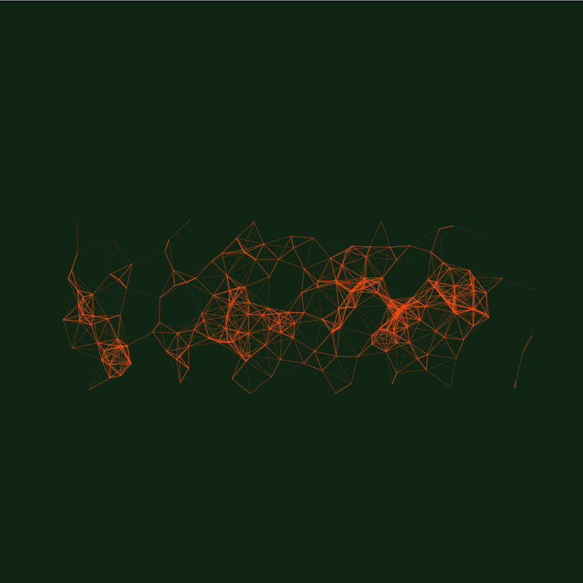
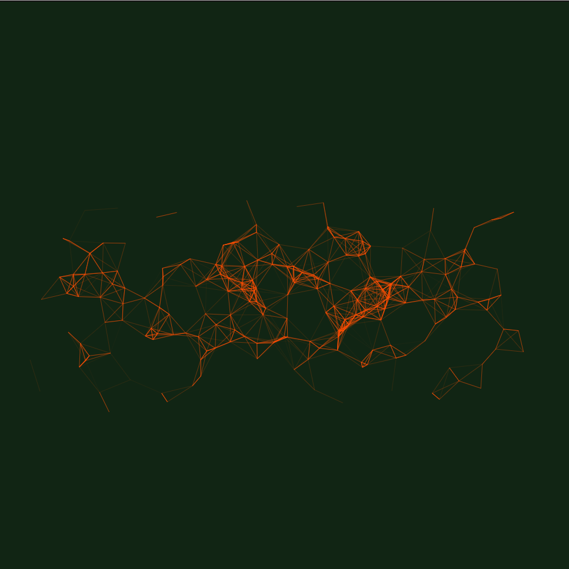

## Typographic Links

Typographic Links can be viewed [here](00_Outputs/02_Typographic_Links/links)

Source code is available [here](https://github.com/DannyRoberts95/Creative-Programming/tree/master/00_Outputs/02_Typographic_Links/links)

### Project Basis

This project revolved around the design of a custom program used to explore typography through creative programming. The project explores the form and structure of the type face and how one may achieve interesting results via breaking or distorting the type face.

The letter forms are first rendered as a hidden Pgraphic object. By looping through the PGraphic pixel array and checking the color value of the pixels, particle objects can be spawned to represent the letter forms.

The particles spawned are animated using vector forces and constantly "seek" their spawn location. When the particles come into contact with the mouse they exhibit a "flee" behaviour to escape the mouse. The particles are not displayed individually but are displayed in relation to other particles by link lines. These link lines between particles give rigid form and structure to the system when still, and an organic fluid like structure when the system is disturbed.

This project also explores the ability of p5.js to manipulate elements in the DOM by adding user input elements as away of interacting with the sketch. By adjusting the variables in the control window, the user can create a range of possible outputs from a dense, rigid structure to a dispersed and abstract form.

#### Below is an example of a progressively distorted type face.

