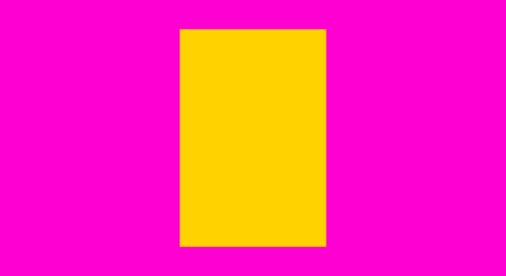
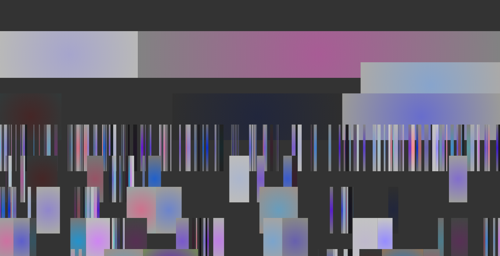

# Section 1 - Color and Color Theory

This repository is a collection of P5 sketches exploring the area of color and color theory. Each sketch can be viewed by clicking the link below the title.

This section will touch on:

- color generation
- interpolation
- palette generation from rule and images
- fragmentation
- randomness
- gradients

---

### 01_Color Compare

[View here](01_colorSquare/build/)

**Generating and contrasting colors.**

Press "S" to save the image as a PNG file.

---

### HSB Color Grid

[View here](02_colorGrid/build/)

**Generating an interactive color grid based off the HSB color model.**

Press "S" to save the image as a PNG file.

---

### HSB Color Wheel

[View here](03_segmentTriangles/build/)

**Generating an interactive color wheel of custom shapes based off the HSB color model.**

Press "S" to save the image as a PNG file.

---

### Interpolation of Color

[View here](04_lerpColors/build/)

**Generating two color arrays and interpolating colors between those arrays.**

Click the mouse to generate new colors.

Press "S" to save the image as a PNG file.

---

### Palette generation from an Image

[View here](05_imageProcessing/build/)

**Reducing the resolution of an image and sampling the pixelated image to generate an ASE swatch file.**

Press 1 - 5 to load new images.

Press "C" to save the image as an ASE swatch file.

Press "S" to save the image as a PNG file.

---

### Palette generation from Color Rules

[View here](06_generateColorPal/build/)

**Generate color palettes that adhere to a specific rulesets.**

Press 1-9 to change the rules by which colors are generated.

Press "S" to save the image as a PNG file.

---

### Fragmentation and Color Rules

[View here](07_fragments/build/)

**Generating rows of fragments colored according to a ruleset.**

Click to generate new fragments.

Press "S" to save the image as a PNG file.

---

## Fragmentation with Alpha

[View here](08_alphaFragments/build/)

**Generating rows of fragments colored according to a ruleset and distorted by noise.**

Click to generate new fragments.

Press "S" to save the image as a PNG file.

---

### Fragmentation with Alpha and Radial Gradients

[View here](09_radialGradients/build/)

**Generating rows of fragments colored by radial gradients according to a ruleset.**

Click to generate new fragments.

Press "S" to save the image as a PNG file.
