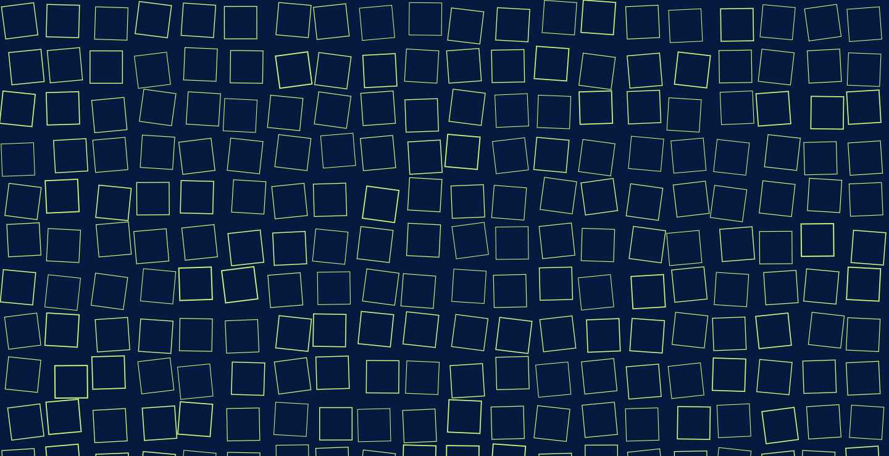

# Section 2 - Shape

This repository is a collection of P5 sketches exploring the areas of shape and pattern. Each sketch can be viewed by clicking the link below the title.

This section will touch on:

- polar co-ordinates
- beginShape & endShape functions
- vertices
- grid systems & distortion of grid systems
- rotation of a system elements
- mouse interaction

---

### Vertex Circle

[View here](01_line_circle/build/)

**Creating a circle through use of vertices and begin shape.**

Press "S" to save the image as a PNG file.

---

### Custom Vertex Shape

[View here](02_changing_shape/build/)

**Creating a custom shape by altering the number of vertex points it is composed of.**

Click and drag to draw the shape. Alter the shape by moving the mouse around the screen.

Press 1 to randomise the color;

Press "Back Space" to clear the screen

Press "S" to save the image as a PNG file.

---

### Repetition Within a Grid System

[View here](04_mouse_interaction/build/)

**Creating a grid system populated by shapes rotated to form patterns.**

Press 1 - 3 to alter the stroke style.

Click the mouse to generate a new grid system;

Press "S" to save the image as a PNG file.

---

### Orienting a Grid System Towards the Mouse

[View here](05_mouse_rotation/build/)

**Rotating the elements of a grid system towards the mouse using ATAN2.**

Press 1 - 3 to alter the stroke style.

Press "S" to save the image as a PNG file.

---

### Orienting a Grid System of SVG elements Towards the Mouse

[View here](06_svg/build/)

**Rotating the SVG elements of a grid system towards the mouse using ATAN2.**

Press "S" to save the image as a PNG file.

---

### Offsetting Elements Based on Mouse Location

[View here](07_offsets/build/)

**altering the size and offset of grid elements using the mouse.**

Click to change color.

Press "S" to save the image as a PNG file.

---

### Offset with Multiple Grid Systems

[View here](08_double_grid/build/)

**Obscuring one offset grid with a static grid.**

Click to change color.

Press "S" to save the image as a PNG file.

---

### Scaling Elements by Distance to Mouse

[View here](09_distance_scale/build/)

**Sizing and rotating elements in a grid based on their distance from the mouse.**

Click to change color.

Press "S" to save the image as a PNG file.

---
