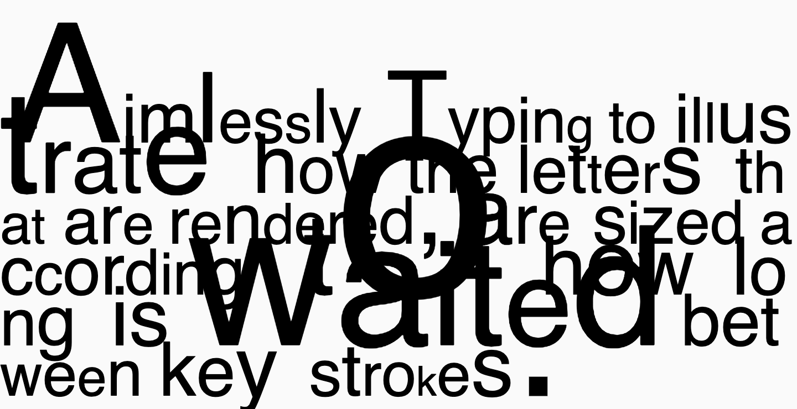

# Section 3 - Type

This repository is a small collection of P5 sketches exploring the area typography. Each sketch can be viewed by clicking the link below the title.

---

### Exploring Letter Forms

[View here](01_size_shape/build/)

**Exploring the shape and form of letter forms.**

Click and hold the mouse to drag the letter form.

Press "S" to save the image as a PNG file.

---

### Time Sized Type

[View here](02_time_based_type/build/)

**As the user types, letters are sized according to the time taken between keystrokes, emphasising the rhythm with which the text is typed.**

Type using your keyboard, varying your typing speed to effect the size of the letter forms.

---
