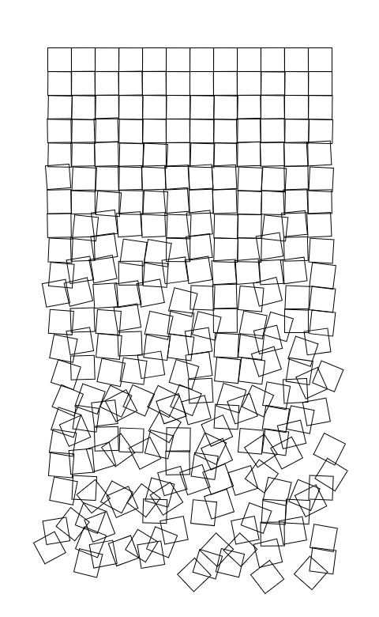

# Generative Design & Creative Coding

This respository is a collection of exercises that explore the area creative programming. The exercises are organised into "Color", "Shape" and "Type" each section containing a list of exercises exploring that area. This exploration resulted in the creation of two design projects, "Typographic Links" and "Bearings". Both of these projects can be viewed below.

## Bearings

[View Here](00_Outputs/bearings)

“Tension is highest when order borders on chaos. Individual forms abandon their strict arrangement in the dynamic grid and submit to random configurations. Elements inclined to the grid and those averse to it fight for visual supremacy. It is the moment of transition that is important.”
Generative Design, Chapter P.2.1.2

This concept is explored in Generative design, in the “Movement in a Grid ” chapter and the results they managed to achieve were simple and effective. The idea of breaking down the structured order of a grid and visualising the transition to a chaotic, distorted system was intriguing and I decided to explore how artists have represented this idea in the past.

### George Nees

In researching this area I discovered the work of Georg Nees. Nees was a German academic and pioneer in the area of computer art and generative graphics, who used lithographs to create his pieces based on computer algorithms he wrote. His piece “Schotter” or “Gravel” created in 1970, beautifully illustrates a transition from order to chaos. I found the way in which Nees used computer graphics to illustrate such an ancient concept using such a simple composition, very intriguing. I decided to use Nees’ work as a baseline for exploring this idea and seeing in what way I could further elaborate on the concept.

## Typographic Links

[Typographic Links](00_Outputs/links)

## Chapters

1. [Color](01_Colors/)
2. [Shape](02_Shape/)
3. [Type](03_Type/)

# Program Lists
