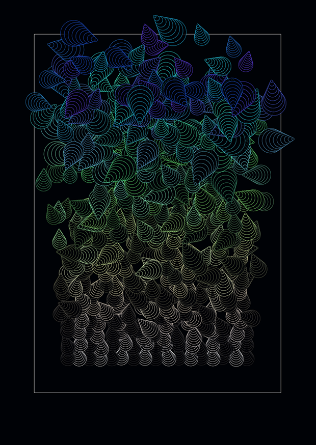
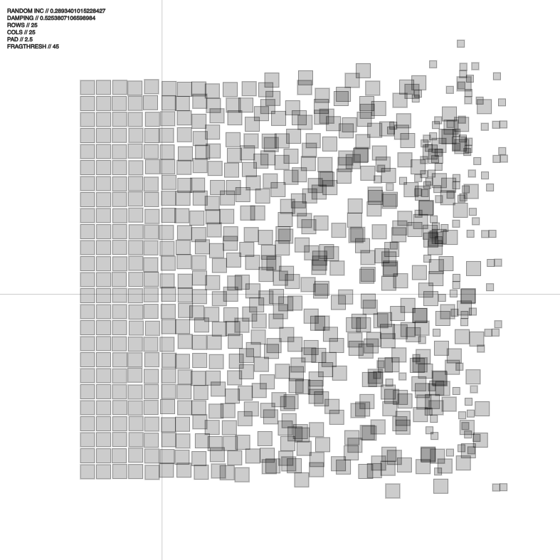
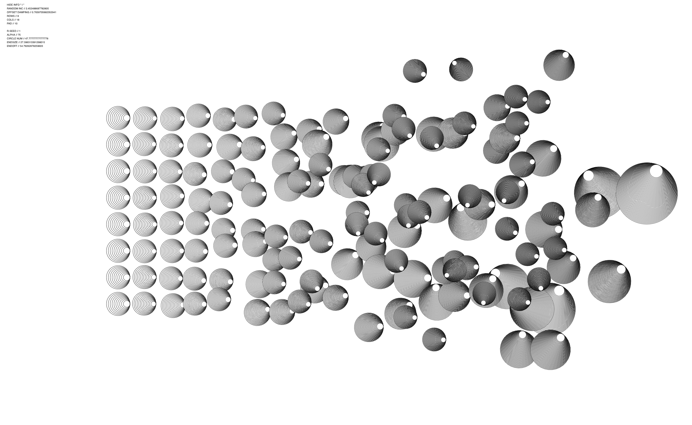
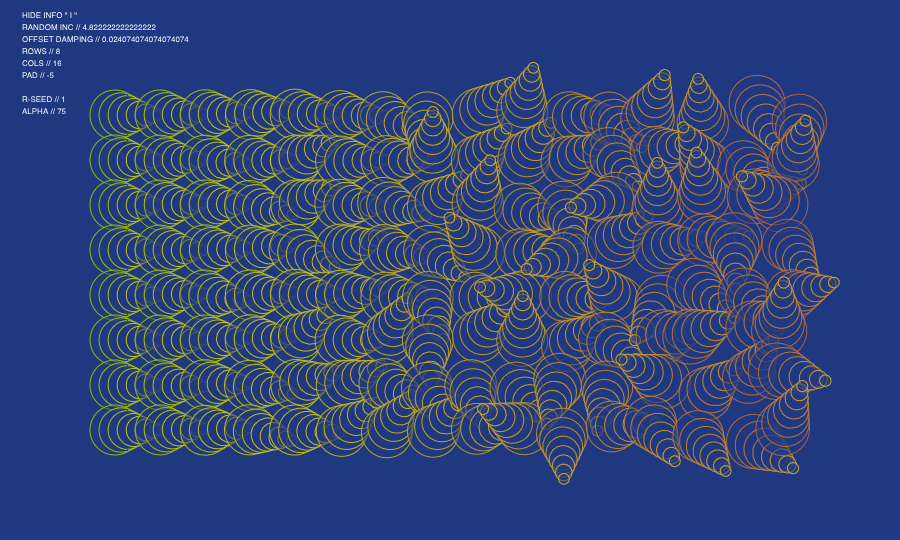
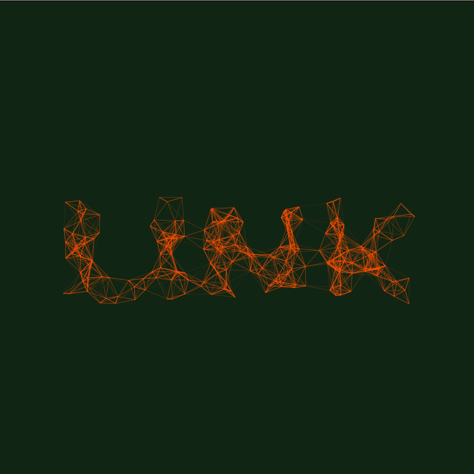

# Generative Design & Creative Coding

This respository is a collection of exercises that explore the area creative programming. The exercises are organised into "Color", "Shape" and "Type" each section containing a list of exercises exploring its respective area. This exploration resulted in the creation of two projects, "Typographic Links" and "Bearings". Both of these projects can be viewed below.

[Bearings](#Bearings)

[Typographic Links](#Typographic-Links)

## Research Topics

1. [Color](01_Colors/)
2. [Shape](02_Shape/)
3. [Type](03_Type/)

## Bearings

Bearings can be viewed [here](00_Outputs/01_Bearings/bearings)

Source code is available [here](https://github.com/DannyRoberts95/Creative-Programming/tree/master/00_Outputs/01_Bearings/bearings)

### Project Basis

This project revolved around the design of a graphic for a book cover on generative design. The project explores the use of color, shape and grid based patterns through creating a javaScript program to create these graphics.

“Tension is highest when order borders on chaos. Individual forms abandon their strict arrangement in the dynamic grid and submit to random configurations. Elements inclined to the grid and those averse to it fight for visual supremacy. It is the moment of transition that is important.”
Generative Design, Chapter P.2.1.2

This concept is explored in Generative design, in the “Movement in a Grid ” chapter and the results they managed to achieve were simple and effective. The idea of breaking down the structured order of a grid and visualising the transition to a chaotic, distorted system was intriguing and I decided to explore how artists have represented this idea in the past.

### George Nees

In researching this area I discovered the work of Georg Nees. Nees was a German academic and pioneer in the area of computer art and generative graphics, who used lithographs to create his pieces based on computer algorithms he wrote. His piece “Schotter” or “Gravel” created in 1970, beautifully illustrates a transition from order to chaos. I found the way in which Nees used computer graphics to illustrate such an ancient concept using such a simple composition, very intriguing. I decided to use Nees’ work as a baseline for exploring this idea and seeing in what way I could further elaborate on the concept.

### Schotter by George Nees recreated in p5.js

#### Below is a collection of some of the notable project iterations.

### Iteration 1

### Iteration 6

### Iteration 7

### Iteration 14

### Iteration 15

### Iteration 16

---

---

## Typographic Links

Typographic Links can be viewed [here](00_Outputs/02_Typographic_Links/links)

Source code is available [here](https://github.com/DannyRoberts95/Creative-Programming/tree/master/00_Outputs/02_Typographic_Links/links)

### Project Basis

This project revolved around the design of a custom program used to explore typography through creative programming. The project explores the form and structure of the type face and how one may achieve interesting results via breaking or distorting the type face.

The letter forms are first rendered as a hidden Pgraphic object. By looping through the PGraphic pixel array and checking the color value of the pixels, particle objects can be spawned to represent the letter forms.

The particles spawned are animated using vector forces and constantly "seek" their spawn location. When the particles come into contact with the mouse they exhibit a "flee" behaviour to escape the mouse. The particles are not displayed individually but are displayed in relation to other particles by link lines. These link lines between particles give rigid form and structure to the system when still, and an organic fluid like structure when the system is disturbed.

This project also explores the ability of p5.js to manipulate elements in the DOM by adding user input elements as away of interacting with the sketch. By adjusting the variables in the control window, the user can create a range of possible outputs from a dense, rigid structure to a dispersed and abstract form.

#### Below is an example of a typeface progressively distorted using the program.

